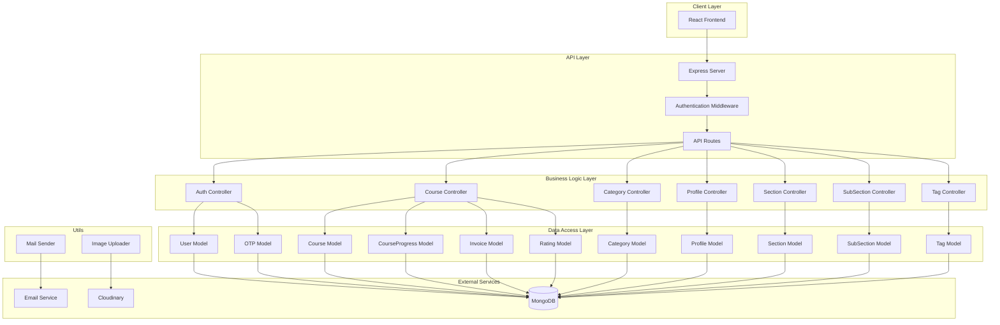

# CodeShala Backend Architecture

## Overview
The CodeShala project is a learning management system built on the MERN (MongoDB, Express.js, React, Node.js) stack. This document outlines the backend architecture, components, and data flow.

## Architecture Diagram

## Modules Breakdown

### Configuration
- **database.js**: Handles MongoDB connection using Mongoose.

### Models
- **Users.js**: User schema with authentication details.
- **Profile.js**: Additional user profile information.
- **course.js**: Course schema with metadata.
- **Category.js**: Course categories.
- **section.js**: Course sections.
- **SubSection.js**: Subsections within sections.
- **Tag.js**: Course tags.
- **otp.js**: OTP storage for verification.
- **courseProgress.js**: User progress tracking.
- **invoice.js**: Payment invoices.
- **ratingandrewies.js**: Course ratings and reviews.

### Controllers
- **Auth.js**: Handles authentication (OTP, signup, login, password change).
- **Course.js**: Course CRUD operations.
- **Category.js**: Category management.
- **Profile.js**: User profile management.
- **Section.js**: Section management within courses.
- **subSection.js**: Subsection management.
- **Tag.js**: Tag management.

### Utils
- **mailsender.js**: Email sending utility using Nodemailer.
- **uploadImageToCloudinary.js**: Image upload to Cloudinary.

## Identified Issues
1. Empty index.js file - no server setup
2. Missing route definitions
3. User model has schema errors (typos, duplicates)
4. OTP not sent via email
5. Inconsistent field naming
6. No authentication middleware
7. Missing input validation
8. Outdated or misspelled dependencies

## Data Flow
1. Client sends request to Express server
2. Authentication middleware verifies JWT tokens
3. Routes direct to appropriate controllers
4. Controllers interact with models for database operations
5. Utils handle external service integrations (email, image upload)
6. Response sent back to client

## Security Considerations
- JWT-based authentication
- Password hashing with bcrypt
- Input validation and sanitization
- CORS configuration
- Cookie-based token storage

## Scalability Features
- Modular controller structure
- Service layer separation
- Database indexing (to be implemented)
- Cloudinary for media storage
- Email service integration